# Sample Size Planning with sspLNIRT

## Introduction

The `sspLNIRT` package provides sample size planning tools for item
calibration under the Joint Hierarchical Model (JHM; van der Linden,
2007). The JHM combines a two-parameter normal ogive model for response
accuracy with a log-normal model for response times, estimated via Gibbs
sampling through the `LNIRT` package (Fox et al., 2023).

The central question the package addresses is: *Given assumptions about
the data-generating process, what is the minimum number of respondents
needed to achieve a desired level of item parameter accuracy?* Accuracy
is defined as the root mean squared error (RMSE) of a target item
parameter falling below a user-specified threshold.

The package supports three workflows, each described in a separate
section of this vignette:

1.  **Shiny app** — an interactive interface for exploring precomputed
    results or generating a customized R script.
2.  **R package with precomputed results** — programmatic access to a
    database of 2,400 precomputed design conditions, with functions for
    retrieval, inspection, and visualization.
3.  **Custom simulations** — running
    [`comp_rmse()`](https://anonymous-peer-2026.github.io/sspLNIRT/reference/comp_rmse.md)
    or
    [`optim_sample()`](https://anonymous-peer-2026.github.io/sspLNIRT/reference/optim_sample.md)
    for design conditions not covered by the precomputed grid.

``` r
# Install from GitHub
if (!requireNamespace("devtools")) install.packages("devtools")
devtools::install_github("anonymous-peer-2026/sspLNIRT")
```

``` r
library(sspLNIRT)
```

## 1. Using the Shiny App

The package includes an interactive Shiny application that provides the
most accessible entry point. Launch it with:

``` r
run_app()
```

The app allows users to:

- Select design parameters (test length, mean item discrimination,
  residual variance level, ability–speed correlation) and target RMSE
  thresholds via dropdown menus.
- Retrieve the corresponding minimum sample size from the precomputed
  database, together with estimation metrics (RMSE, Monte Carlo SD,
  bias) for all item and person parameters.
- Inspect diagnostic plots including estimation accuracy across
  parameter values, power curves, convergence diagnostics, and simulated
  response accuracy and response time distributions.
- Download the result objects (`.rds`) for further use in R.

For design conditions not covered by the precomputed grid, the app can
generate a customized R script with the appropriate function calls,
which can then be executed locally or on a computing cluster. Detailed
documentation of the app interface is available at
<https://github.com/anonymous-peer-2026/sspLNIRT/>.

## 2. Using Precomputed Results in R

This section walks through the full workflow for retrieving and
inspecting precomputed results programmatically. The precomputed
database covers 2,400 design conditions; if your specification falls
within this grid, no simulations are needed.

### 2.1 Check available configurations

Start by inspecting which design conditions are available in the
precomputed grid using
[`available_configs()`](https://anonymous-peer-2026.github.io/sspLNIRT/reference/available_configs.md):

``` r
configs <- available_configs()
head(configs, 10)
#>    thresh out.par  K mu.alpha meanlog.sigma2 rho
#> 1    0.20     phi 50      1.4         log(1) 0.4
#> 2    0.10   alpha 50      1.0         log(1) 0.6
#> 3    0.10    beta 30      0.8       log(0.2) 0.6
#> 4    0.15   alpha 50      1.4       log(0.2) 0.2
#> 5    0.15    beta 50      0.6         log(1) 0.2
#> 6    0.05    beta 50      1.0       log(0.2) 0.2
#> 7    0.15   alpha 50      1.2       log(0.4) 0.2
#> 8    0.10  lambda 50      1.0       log(0.4) 0.6
#> 9    0.10     phi 50      0.8       log(0.6) 0.6
#> 10   0.05   alpha 50      1.4       log(0.4) 0.6
```

Each row represents one precomputed optimization run. The columns
correspond to the design factors that were systematically varied:
`thresh` (RMSE threshold), `out.par` (target item parameter), `K` (test
length), `mu.alpha` (mean item discrimination), `meanlog.sigma2`
(log-scale mean of the residual variance $\sigma^{2}$), and `rho`
(ability–speed correlation). All other model parameters (e.g., mean item
difficulty, item parameter correlations, standard deviations) were held
constant across the grid. Their values are stored in the `design`
element of each result (see Section 2.3).

To check the available levels per factor:

``` r
unique(configs$out.par)
#> [1] "phi"    "alpha"  "beta"   "lambda"
unique(configs$thresh)
#> [1] 0.20 0.10 0.15 0.05
unique(configs$K)
#> [1] 50 30
unique(configs$mu.alpha)
#> [1] 1.4 1.0 0.8 0.6 1.2
unique(configs$meanlog.sigma2)
#> [1] "log(1)"   "log(0.2)" "log(0.4)" "log(0.6)" "log(0.8)"
unique(configs$rho)
#> [1] 0.4 0.6 0.2
```

### 2.2 Retrieve the minimum sample size

The
[`get_sspLNIRT()`](https://anonymous-peer-2026.github.io/sspLNIRT/reference/get_sspLNIRT.md)
function looks up precomputed results by matching on the six design
factors. It accepts vectors for `thresh` and `out.par` to target
multiple item parameters simultaneously:

``` r
result <- get_sspLNIRT(
  thresh         = c(0.10, 0.20, 0.05, 0.05),
  out.par        = c("alpha", "beta", "phi", "lambda"),
  K              = 30,
  mu.alpha       = 1,
  meanlog.sigma2 = log(0.6),
  rho            = 0.4
)
```

Because the precomputed database stores results for each target
parameter separately,
[`get_sspLNIRT()`](https://anonymous-peer-2026.github.io/sspLNIRT/reference/get_sspLNIRT.md)
matches each `out.par`/`thresh` pair independently. It then returns the
bottleneck result — the parameter that required the largest sample size,
since that $N$ guarantees all other parameters also meet their (less
demanding) thresholds.

The [`summary()`](https://rdrr.io/r/base/summary.html) method provides a
concise overview:

``` r
summary(result$object)
#> ==================================================
#> 
#> Call: optim_sample()
#> 
#> Sample Size Optimization
#> --------------------------------------------------
#>   Min Sample Size:       460 
#>   Critical Parameter:      alpha 
#>   RMSE at Min N:         0.0984 
#>   Optimizer Steps:       13 
#>   Time Taken:            3.901599 hours 
#> 
#> Item Parameter RMSEs:
#> --------------------------------------------------
#>        alpha   beta     phi lambda sigma2
#> RMSE  0.0984 0.1080  0.0384 0.0442 0.0475
#> MC SD 0.0145 0.0203  0.0060 0.0114 0.0060
#> Bias  0.0003 0.0036 -0.0007 0.0014 0.0249
#> 
#> Person Parameter RMSEs:
#> --------------------------------------------------
#>        theta   zeta
#> RMSE  0.2920 0.2586
#> MC SD 0.0141 0.0177
#> Bias  0.0022 0.0032
#> ---
```

For planning based on a single parameter, scalar inputs work the same
way:

``` r
res_alpha <- get_sspLNIRT(
  thresh         = 0.10,
  out.par        = "alpha",
  K              = 30,
  mu.alpha       = 1,
  meanlog.sigma2 = log(0.6),
  rho            = 0.4
)
summary(res_alpha$object)
#> ==================================================
#> 
#> Call: optim_sample()
#> 
#> Sample Size Optimization
#> --------------------------------------------------
#>   Min Sample Size:       460 
#>   Critical Parameter:      alpha 
#>   RMSE at Min N:         0.0984 
#>   Optimizer Steps:       13 
#>   Time Taken:            3.901599 hours 
#> 
#> Item Parameter RMSEs:
#> --------------------------------------------------
#>        alpha   beta     phi lambda sigma2
#> RMSE  0.0984 0.1080  0.0384 0.0442 0.0475
#> MC SD 0.0145 0.0203  0.0060 0.0114 0.0060
#> Bias  0.0003 0.0036 -0.0007 0.0014 0.0249
#> 
#> Person Parameter RMSEs:
#> --------------------------------------------------
#>        theta   zeta
#> RMSE  0.2920 0.2586
#> MC SD 0.0141 0.0177
#> Bias  0.0022 0.0032
#> ---
```

### 2.3 Understand the output

The object returned by
[`get_sspLNIRT()`](https://anonymous-peer-2026.github.io/sspLNIRT/reference/get_sspLNIRT.md)
is a list with two elements:

- **`result$object`**: the optimization result (class
  `sspLNIRT.object`), containing:
  - `N.min` — the minimum sample size identified by the bisection
    optimizer. If the lower bound already satisfied the threshold, this
    is the string `"res.lb < thresh"`; if the upper bound was
    insufficient, `"res.ub > thresh"`.
  - `res.best` — the RMSE of the target parameter at `N.min`.
  - `comp.rmse` — the full accuracy evaluation at `N.min`, including
    RMSE, MC SD, and bias for all item and person parameters, as well as
    binned error data and convergence diagnostics.
  - `trace` — the optimization trace: sample sizes and RMSE values at
    each bisection step, the number of steps, and the elapsed time.
- **`result$design`**: the full set of input parameters used for the
  precomputation (class `sspLNIRT.design`). This includes the constant
  parameters that were not varied across the grid:

``` r
str(result$design, max.level = 1)
#> List of 19
#>  $ thresh        : num 0.1
#>  $ range         : num [1:2] 50 2000
#>  $ out.par       : chr "alpha"
#>  $ iter          : num 200
#>  $ K             : num 30
#>  $ mu.person     : num [1:2] 0 0
#>  $ mu.item       : num [1:4] 1 0 0.5 1
#>  $ meanlog.sigma2: num -0.511
#>  $ cov.m.person  : num [1:2, 1:2] 1 0.4 0.4 1
#>  $ cov.m.item    : num [1:4, 1:4] 1 0 0 0 0 1 0 0.4 0 0 ...
#>  $ sd.item       : num [1:4] 0.2 1 0.2 0.5
#>  $ cor2cov.item  : logi TRUE
#>  $ sdlog.sigma2  : num 0
#>  $ item.pars.m   : NULL
#>  $ XG            : num 5000
#>  $ burnin        : num 20
#>  $ seed          : num 311971
#>  $ keep.rhat.dat : logi TRUE
#>  $ keep.err.dat  : logi FALSE
#>  - attr(*, "class")= chr "sspLNIRT.design"
```

Notably, `result$design$out.par` and `result$design$thresh` identify
which single-parameter configuration was the bottleneck:

``` r
result$design$out.par
#> [1] "alpha"
result$design$thresh
#> [1] 0.1
```

This tells you which parameter drove the minimum sample size. In the
multi-parameter call above, the returned `N.min` and all diagnostics
correspond to the optimization run for this bottleneck parameter.

### 2.4 Inspect the implied distributions

With the design object in hand, you can inspect what the assumed
parameter values imply for observable data. The
[`plot_RA()`](https://anonymous-peer-2026.github.io/sspLNIRT/reference/plot_RA.md)
and
[`plot_RT()`](https://anonymous-peer-2026.github.io/sspLNIRT/reference/plot_RT.md)
functions simulate data under the specified model and display the
resulting distributions. Using `result$design` avoids having to
re-specify all the constant parameters manually:

``` r
cfg <- result$design
sim.mod.args <- list(
  K              = cfg$K,
  mu.person      = cfg$mu.person,
  mu.item        = cfg$mu.item,
  meanlog.sigma2 = cfg$meanlog.sigma2,
  sdlog.sigma2   = cfg$sdlog.sigma2,
  cov.m.person   = cfg$cov.m.person,
  cov.m.item     = cfg$cov.m.item,
  sd.item        = cfg$sd.item,
  cor2cov.item   = cfg$cor2cov.item
)
```

**Item-level response accuracy.** With `by.theta = TRUE`,
[`plot_RA()`](https://anonymous-peer-2026.github.io/sspLNIRT/reference/plot_RA.md)
shows item characteristic curves (ICCs) — the probability of a correct
response as a function of ability $\theta$. Each panel corresponds to
one item. The dashed vertical line marks the item difficulty ($\beta$),
and the faint dots show simulated binary responses:

``` r
do.call(plot_RA, c(list(level = "item", by.theta = TRUE, N = 1e4), sim.mod.args))
```

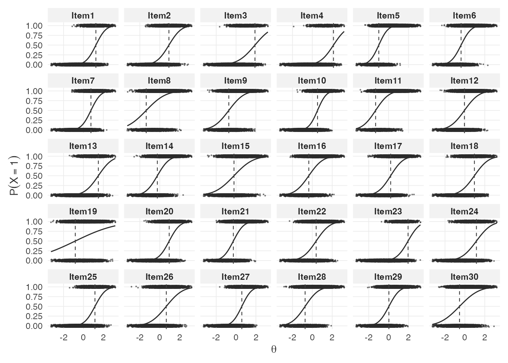

Setting `by.theta = FALSE` shows the marginal distribution of response
probabilities across persons for each item:

``` r
do.call(plot_RA, c(list(level = "item", by.theta = FALSE, N = 1e4), sim.mod.args))
```

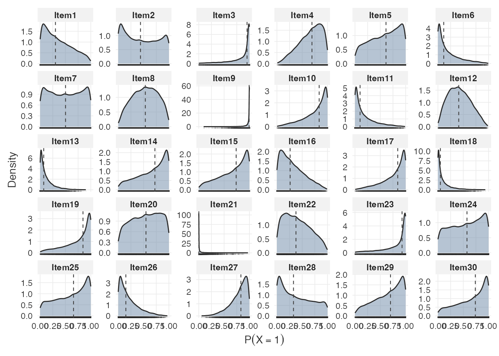

**Person-level response accuracy.** The total correct score distribution
provides a summary of expected test performance:

``` r
do.call(plot_RA, c(list(level = "person", by.theta = FALSE, N = 1e4), sim.mod.args))
```

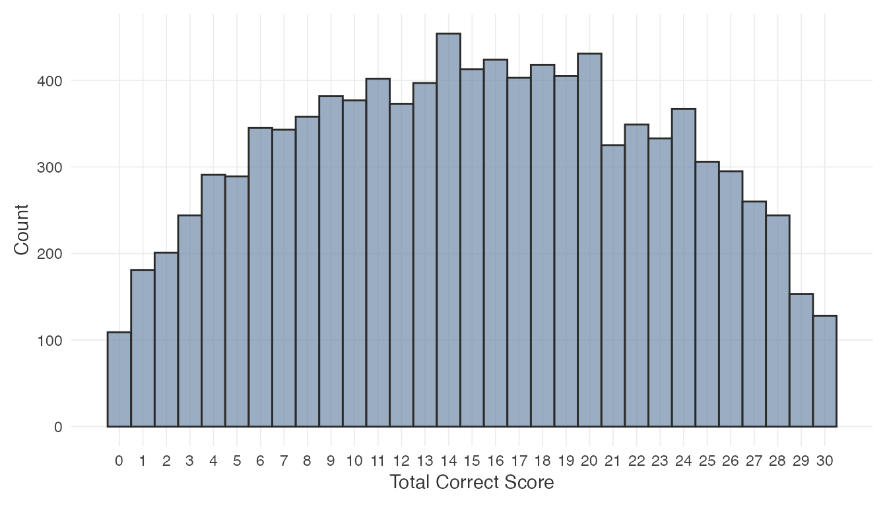

The `by.theta = TRUE` variant shows mean total score as a function of
ability:

``` r
do.call(plot_RA, c(list(level = "person", by.theta = TRUE, N = 1e4), sim.mod.args))
```

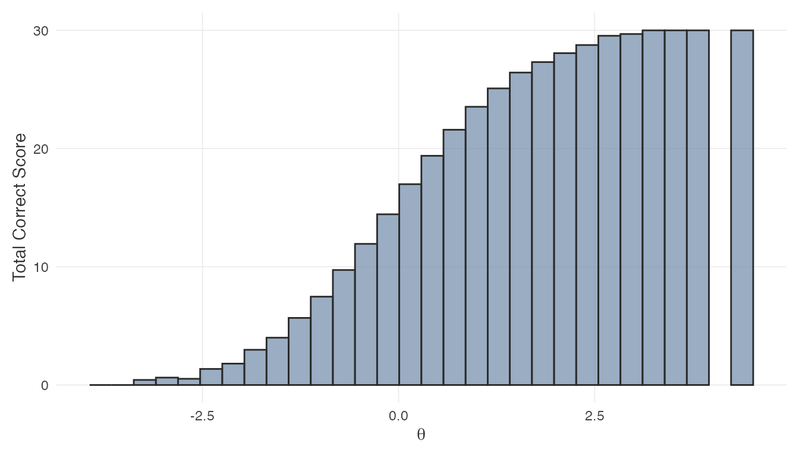

**Item-level response times.** Each panel shows the RT density for one
item. The `logRT` argument toggles between seconds and the log scale:

``` r
do.call(plot_RT, c(list(level = "item", logRT = FALSE, N = 1e4), sim.mod.args))
```

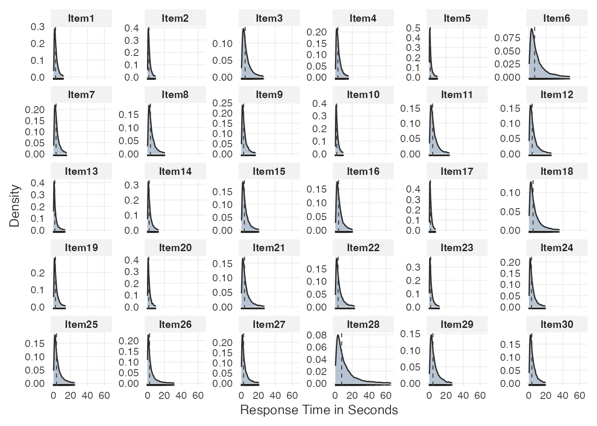

``` r
do.call(plot_RT, c(list(level = "item", logRT = TRUE, N = 1e4), sim.mod.args))
```

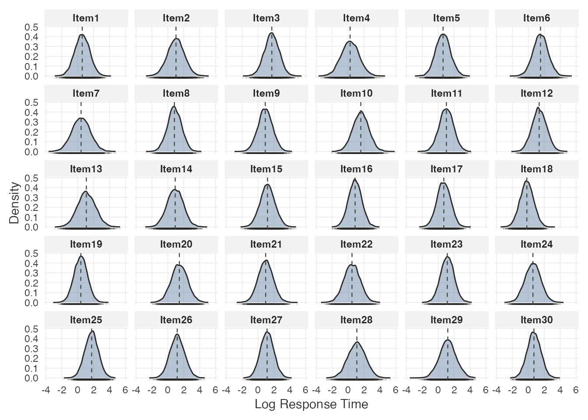

**Person-level response times.** Quantile reference lines summarize the
distribution of mean response times across persons:

``` r
do.call(plot_RT, c(list(level = "person", logRT = TRUE, N = 1e4), sim.mod.args))
```

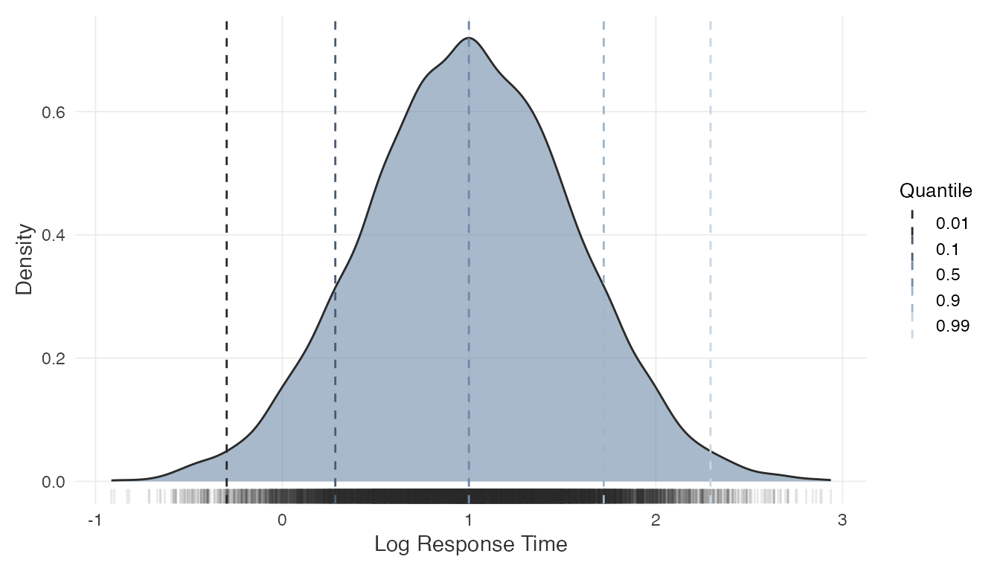

``` r
do.call(plot_RT, c(list(level = "person", logRT = FALSE, N = 1e4), sim.mod.args))
```

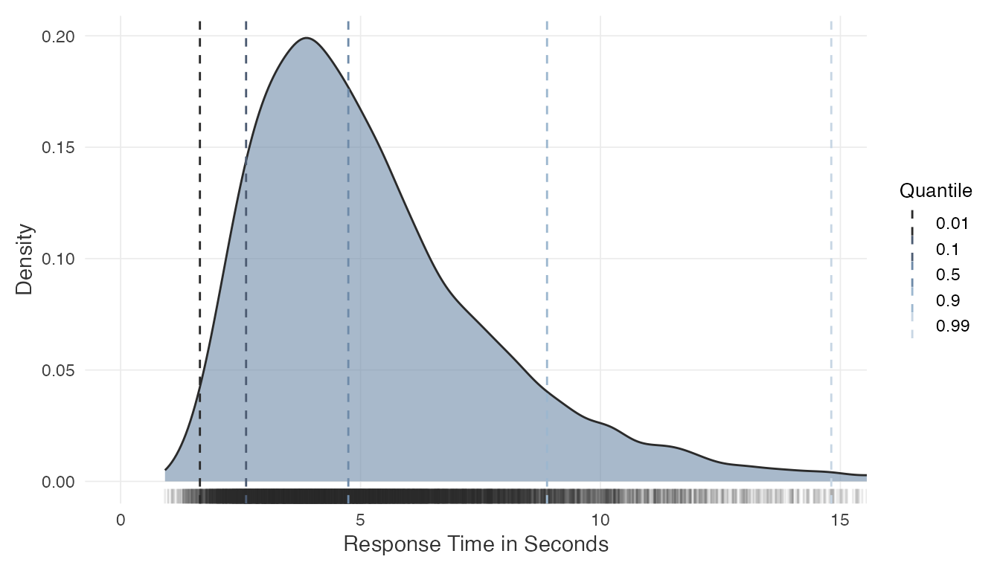

These plots help evaluate whether the assumed data-generating process
produces plausible score and time distributions for the intended
application. They may also inform adjustments to the input parameters
before committing to a sample size.

### 2.5 Inspect estimation accuracy

The
[`plot_estimation()`](https://anonymous-peer-2026.github.io/sspLNIRT/reference/plot_estimation.md)
function displays RMSE or bias as a function of the true (simulated)
parameter values at the minimum $N$. This can quantify to what extent
estimation accuracy varies systematically across the parameter range.
For instance, how much items with extreme difficulty values tend to be
estimated less precisely.

For item parameters:

``` r
plot_estimation(result$object, pars = "item", y.val = "rmse")
```

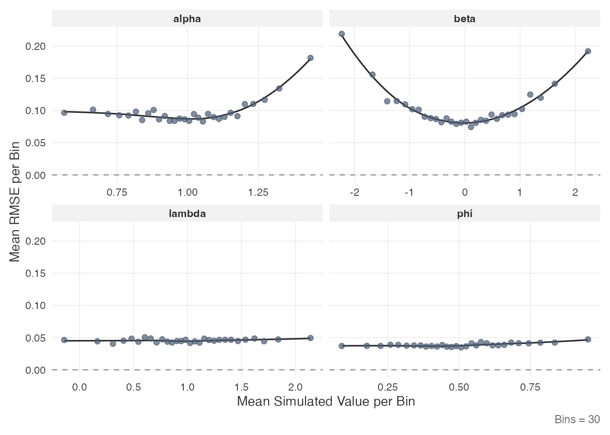

``` r
plot_estimation(result$object, pars = "item", y.val = "bias")
```

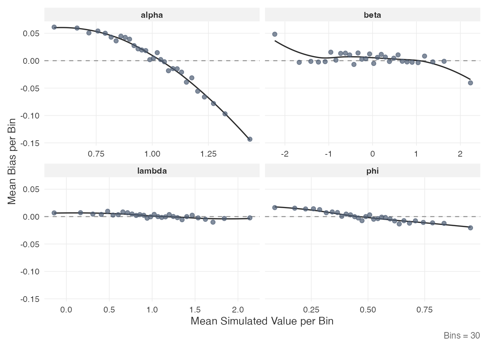

For person parameters:

``` r
plot_estimation(result$object, pars = "person", y.val = "rmse")
```

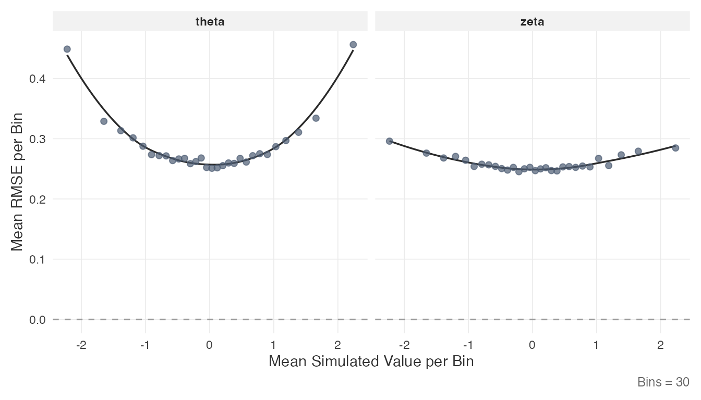

Each point represents the mean value within a quantile bin of the true
parameter. The smooth line is a LOESS fit.

### 2.6 Inspect the power curve

The
[`plot_power_curve()`](https://anonymous-peer-2026.github.io/sspLNIRT/reference/plot_power_curve.md)
function fits a log-log regression through the bisection trace and
displays the relationship between sample size and RMSE:

``` r
plot_power_curve(result$object, out.par = result$design$out.par,
                 thresh = result$design$thresh)
```

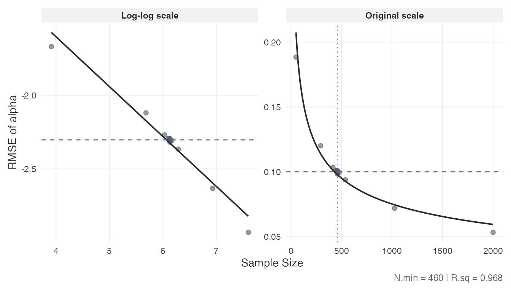

The dashed horizontal line marks the RMSE threshold; the dotted vertical
line marks the minimum $N$. The left panel shows the log-log fit; the
right panel shows the same relationship on the original scale. The
$R^{2}$ of the log-log regression is reported in the caption.

### 2.7 Inspect convergence diagnostics

Convergence of the MCMC chains can be assessed from the $\widehat{R}$
diagnostics stored in the result object. These are quantiles of the
$\widehat{R}$ statistic (Vehtari et al., 2021) across Monte Carlo
iterations:

``` r
rhat <- result$object$comp.rmse$rhat.dat
if (!is.null(rhat)) {
  if (is.data.frame(rhat) || is.matrix(rhat)) {
    round(rhat, 4)
  }
}
#>      alpha   beta    phi lambda sigma2
#> 50% 1.0030 1.0012 1.0001 1.0001 1.0001
#> 80% 1.0064 1.0033 1.0002 1.0002 1.0002
#> 90% 1.0105 1.0058 1.0003 1.0003 1.0003
#> 95% 1.0156 1.0093 1.0004 1.0004 1.0003
```

Values of 1 indicate that the chains have mixed well. The rows represent
quantiles (50th, 80th, 90th, 95th percentile); the columns correspond to
item parameters.

## 3. Custom Simulations

When the intended design is not covered by the precomputed grid, the
package provides two functions for running simulations directly:

- [`comp_rmse()`](https://anonymous-peer-2026.github.io/sspLNIRT/reference/comp_rmse.md)
  evaluates item parameter accuracy at a single, fixed sample size.
- [`optim_sample()`](https://anonymous-peer-2026.github.io/sspLNIRT/reference/optim_sample.md)
  runs the bisection optimizer to find the minimum sample size for a
  target RMSE threshold.

Both functions are computationally intensive (minutes to hours depending
on settings) and benefit from parallel execution.

### 3.1 Setup

The simulation and estimation are parallelized over Monte Carlo
replications using the `future` framework. Set up a parallel backend
before calling either function:

``` r
library(future)
plan(multisession, workers = 4)
```

### 3.2 Evaluate accuracy at a fixed N

[`comp_rmse()`](https://anonymous-peer-2026.github.io/sspLNIRT/reference/comp_rmse.md)
simulates data, fits the model, and computes RMSE, MC SD, and bias for
all item and person parameters at a specified sample size:

``` r
rmse_result <- comp_rmse(
  N              = 200,
  iter           = 200,
  K              = 30,
  mu.person      = c(0, 0),
  mu.item        = c(1, 0, 0.5, 1),
  meanlog.sigma2 = log(0.6),
  cov.m.person   = matrix(c(1, 0.4, 0.4, 1), ncol = 2),
  cov.m.item     = matrix(c(1, 0, 0, 0,
                             0, 1, 0, 0.4,
                             0, 0, 1, 0,
                             0, 0.4, 0, 1), ncol = 4),
  sd.item        = c(0.2, 1, 0.2, 0.5),
  cor2cov.item   = TRUE,
  sdlog.sigma2   = 0,
  XG             = 5000,
  burnin         = 20,
  seed           = 1234,
  keep.err.dat   = TRUE,
  keep.rhat.dat  = TRUE
)

summary(rmse_result)
```

Key arguments:

- `iter`: number of Monte Carlo replications (simulated datasets).
  Higher values reduce the MC standard deviation of the RMSE estimate.
- `XG`: number of Gibbs sampler iterations per chain (4 chains are run
  per replication).
- `keep.err.dat`: if `TRUE`, retains the full per-replication error data
  (needed for
  [`plot_estimation()`](https://anonymous-peer-2026.github.io/sspLNIRT/reference/plot_estimation.md)
  with custom binning). If `FALSE`, errors are pre-binned into `K`
  quantile bins.
- `keep.rhat.dat`: if `TRUE`, retains the $\widehat{R}$ matrix across
  replications.
- `seed`: passed to `future.apply` for parallel-safe reproducibility.

The output has the same `sspLNIRT.object` class as
[`optim_sample()`](https://anonymous-peer-2026.github.io/sspLNIRT/reference/optim_sample.md)
results and works with
[`summary()`](https://rdrr.io/r/base/summary.html),
[`plot_estimation()`](https://anonymous-peer-2026.github.io/sspLNIRT/reference/plot_estimation.md),
and [`print()`](https://rdrr.io/r/base/print.html).

### 3.3 Optimize for the minimum sample size

[`optim_sample()`](https://anonymous-peer-2026.github.io/sspLNIRT/reference/optim_sample.md)
wraps
[`comp_rmse()`](https://anonymous-peer-2026.github.io/sspLNIRT/reference/comp_rmse.md)
in a bisection loop. It accepts vectors for `thresh` and `out.par` to
simultaneously target multiple item parameters:

``` r
custom_result <- optim_sample(
  thresh         = c(0.10, 0.15),
  out.par        = c("alpha", "beta"),
  range          = c(50, 2000),
  iter           = 200,
  K              = 30,
  mu.person      = c(0, 0),
  mu.item        = c(1, 0, 0.5, 1),
  meanlog.sigma2 = log(0.6),
  cov.m.person   = matrix(c(1, 0.4, 0.4, 1), ncol = 2),
  cov.m.item     = matrix(c(1, 0, 0, 0,
                             0, 1, 0, 0.4,
                             0, 0, 1, 0,
                             0, 0.4, 0, 1), ncol = 4),
  sd.item        = c(0.2, 1, 0.2, 0.5),
  cor2cov.item   = TRUE,
  sdlog.sigma2   = 0,
  XG             = 5000,
  burnin         = 20,
  seed           = 1234,
  keep.err.dat   = FALSE,
  keep.rhat.dat  = TRUE
)

summary(custom_result)
```

The `range` argument sets the search interval for $N$. The bisection
halves the interval at each step, evaluating
[`comp_rmse()`](https://anonymous-peer-2026.github.io/sspLNIRT/reference/comp_rmse.md)
at the midpoint, until no further refinement is possible (i.e., the
interval width is one). The number of bisection steps is approximately
$\lceil\log_{2}\left( \text{range}\lbrack 2\rbrack - \text{range}\lbrack 1\rbrack \right)\rceil$,
each requiring a full
[`comp_rmse()`](https://anonymous-peer-2026.github.io/sspLNIRT/reference/comp_rmse.md)
evaluation.

When multiple parameters are targeted, the bisection requires *all*
specified parameters to simultaneously fall below their respective
thresholds before narrowing the search interval, so the resulting $N$
satisfies all targets at once. This differs from the
[`get_sspLNIRT()`](https://anonymous-peer-2026.github.io/sspLNIRT/reference/get_sspLNIRT.md)
approach, which looks up each parameter independently and selects the
bottleneck post hoc.

The result object supports the same inspection functions demonstrated in
Section 2:

``` r
plot_estimation(custom_result, pars = "item", y.val = "rmse")
plot_power_curve(custom_result, out.par = "alpha", thresh = 0.10)
```

### 3.4 Practical considerations

- **Computation time**: a single
  [`comp_rmse()`](https://anonymous-peer-2026.github.io/sspLNIRT/reference/comp_rmse.md)
  call with `iter = 200` and `XG = 5000` can take minutes to hours
  depending on $N$, $K$, and available cores. The full bisection
  typically requires 10–13 evaluations, so
  [`optim_sample()`](https://anonymous-peer-2026.github.io/sspLNIRT/reference/optim_sample.md)
  can take several hours.
- **Parallelization**: setting `future::plan(multisession)` with
  multiple workers distributes replications across cores. The number of
  workers should match available cores.
- **Reproducibility**: the `seed` argument ensures parallel-safe
  reproducibility via L’Ecuyer-CMRG streams. Pass an explicit integer
  for full reproducibility.
- **Memory**: with `keep.err.dat = TRUE`, the full error arrays are
  retained in memory. For large $N$ and $K$, setting this to `FALSE`
  reduces memory usage by pre-binning errors.

``` r
# Reset to sequential when done
plan(sequential)
```

## References

Fox, J.-P., Klotzke, K., & Simsek, A. S. (2023). R-package LNIRT for
joint modeling of response accuracy and times. *PeerJ Computer Science*,
*9*, e1232. <https://doi.org/10.7717/peerj-cs.1232>

van der Linden, W. J. (2007). A hierarchical framework for modeling
speed and accuracy on test items. *Psychometrika*, *72*(3), 287–308.
<https://doi.org/10.1007/s11336-006-1478-z>

Vehtari, A., Gelman, A., Simpson, D., Carpenter, B., & Bürkner, P.-C.
(2021). Rank-normalization, folding, and localization: An improved
$\widehat{R}$ for assessing convergence of MCMC (with discussion).
*Bayesian Analysis*, *16*(2), 667–718.
<https://doi.org/10.1214/20-BA1221>
