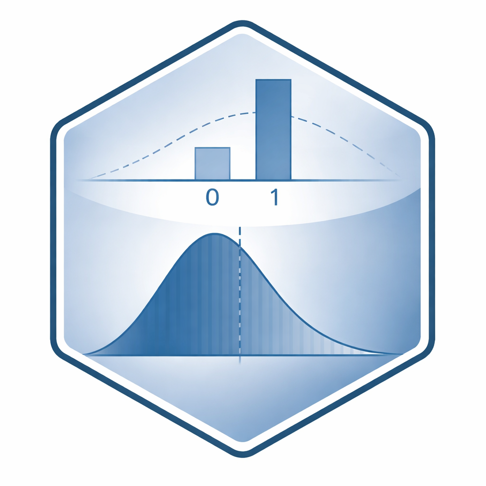

Welcome to the sspLNIRT App
================

 

### Sample Size Planning for Item Calibration with the Joint Hierarchical Model

`sspLNIRT` estimates the minimum sample size needed to achieve a desired
accuracy of item parameter estimates under the Joint Hierarchical Model
(JHM) of response accuracy and response time.

The JHM combines a 2-parameter normal ogive model for response accuracy
with a 3-parameter log-normal model for response times, with a
higher-level joint distributions (see [van der Linden,
2007](https://doi.org/10.1007/s11336-006-1478-z); [Klein Entink et al.,
2009](https://doi.org/10.1007/s11336-008-9075-y)). The model is
estimated via the `LNIRT` package (see [Fox et al.,
2023](https://doi.org/10.7717/peerj-cs.1232)).

 

### Precomputed Results

The **Precomputed** tab provides instant access to minimum sample sizes
across many design conditions. Select the input parameters, e.g., test
length, target item parameter, desired RMSE threshold, and the app
retrieves the corresponding result from a precomputed database. **No
simulations** are run. The output includes:

- **Minimum N** — the smallest sample size achieving the target RMSE,
  from a bisection search optimizer.
- **Estimation at Minimum N** — RMSE, Monte Carlo SD, and bias for all
  item and person parameters at the minimum sample size.
- **Diagnostic plots** — parameter accuracy and bias (at minimum N)
  across true values, the power curve fitted to the optimization steps,
  simulated response time and response accuracy distributions, and R_hat
  convergence tables.

 

### Custom Optimization

The **Custom** tab allows running the sample size optimization for
design conditions not covered by the precomputed grid. Specify custom
item parameter means, covariance structures, residual variance settings,
and other model parameters. Download the R script from the App and run
it locally. The script calls `optim_sample()` and runs the full sample
size estimation procedure, which requires substantial computation time.

More details regarding the `sspLNIRT` application in R can be found in
this
[tutorial](https://github.com/anonymous-peer-2026/sspLNIRT/articles/).
